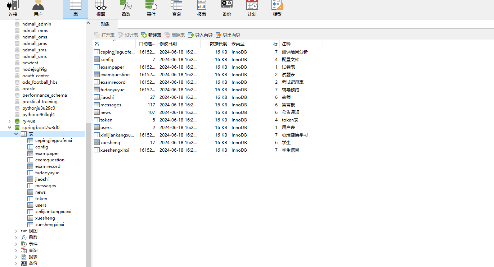
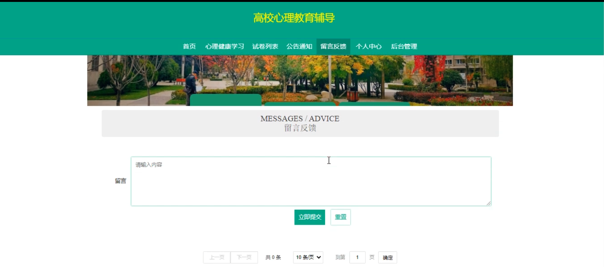

# 基于Springboot的高校心理教育辅导设计与实现

#### 介绍
高校心理教育辅导系统是一款专为高校师生设计的心理健康教育和辅导平台，旨在提升学生的心理健康水平，帮助教师更高效地管理和辅导学生。系统设计包括教师角色和学生角色两个部分，每个角色配备了相应的功能模块，以满足各自的需求和操作习惯。

#### 技术栈介绍

后端技术栈：Springboot+Mysql+Maven

前端技术栈：Vue+Html+Css+Javascript+ElementUI

开发工具：Idea+Vscode+Navicate

#### 系统功能介绍

教师端的功能模块

个人中心：教师可以在此查看和修改个人信息，管理账户安全设置，方便日常操作。

辅导预约管理：教师可以管理学生的辅导预约，查看预约详情，安排辅导时间。

学生信息管理：教师可以查看和管理学生的基本信息，包括联系方式、辅导记录等。

测评结果分析管理：教师可以查看和分析学生的心理测评结果，了解学生的心理健康状况，为辅导提供依据。

心理健康学习管理：教师可以上传和管理心理健康学习资料，帮助学生自主学习心理知识。

试卷管理：教师可以创建、编辑和管理心理健康相关的试卷，供学生测试和学习。

试题管理：教师可以管理试卷中的试题，添加、删除和修改试题内容。

留言板管理：教师可以查看和回复学生的留言，及时解答学生的问题和疑虑。

学生角色功能模块

心理健康学习：学生可以浏览和学习教师上传的心理健康资料，提升自身心理素质。

试卷列表：学生可以查看和完成系统中提供的心理健康试卷，了解自己的心理健康状况。

公告通知：学生可以查看教师发布的公告和通知，及时获取重要信息。

留言反馈：学生可以在留言板上向教师提问，反馈自己的问题和建议。

个人中心：学生可以查看和修改个人信息，管理账户安全设置。

后台管理：

辅导预约管理：学生可以预约心理辅导，与教师约定辅导时间。

考试管理：学生可以查看和管理自己的考试信息，完成教师布置的心理健康测试。

#### 系统作用

对教师的作用

高效的学生管理：教师可以通过系统高效地管理学生信息和辅导预约，提升工作效率。

准确的测评分析：系统提供测评结果分析功能，帮助教师全面了解学生的心理健康状况。

丰富的教学资源管理：教师可以上传和管理心理健康学习资料和试卷，方便学生自主学习和测试。

及时的交流互动：通过留言板功能，教师可以及时解答学生的问题，加强师生互动。

对学生的作用

便捷的学习资源获取：学生可以方便地访问和学习心理健康资料，提升心理知识。

自我测评与反馈：学生可以通过试卷和测评功能，了解自己的心理健康状况，并获得反馈和建议。

灵活的辅导预约：学生可以通过系统预约辅导，与教师进行面对面的交流和辅导。

及时的信息获取：通过公告通知和留言反馈功能，学生可以及时获取重要信息和反馈意见。

#### 系统功能截图

代码结构

数据库表

登录

首页

心理健康学习

试卷列表

留言反馈

教师端个人信息

学生信息

测评结果分析

心理健康学习

试题管理

学生端后台管理

#### 总结

高校心理教育辅导系统通过分角色、分模块的设计，实现了教师和学生的全面功能覆盖。教师角色的高效管理和丰富的教学资源，为学生提供了良好的学习和辅导支持；学生角色的便捷学习和自我测评功能，满足了学生的多样化需求。系统通过丰富的交流互动和全面的心理健康管理，提升了师生之间的沟通效率和学生的心理健康水平。未来，本系统将继续优化和扩展功能，为高校心理教育提供更加优质的服务和支持。

#### 使用说明

创建数据库，执行数据库脚本 修改jdbc数据库连接参数 下载安装maven依赖jar 启动idea中的springboot项目

后台地址：http://localhost:8080/springboot7w3d0/admin/dist/index.html

管理员  abo 密码 abo

前台地址：http://localhost:8080/springboot7w3d0/front/index.html